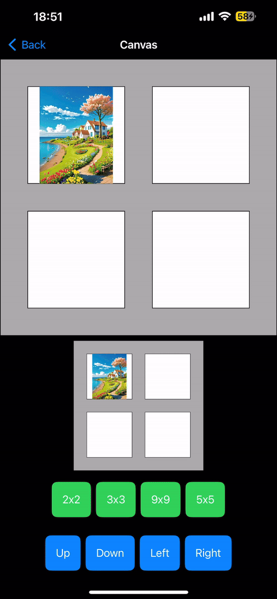

# Technical Assignment

## Introduction

This project is a Technical Assignment built using the MVVM architecture, combined with the use of module packages. The main packages included are:

- **CoreUI package**: Contains custom UI components that are commonly used throughout the application.
- **MPFilters package**: A package designed to use MetalPetal for image processing.
  
The project utilizes **Swift Package Manager (SPM)** for package management to streamline dependencies.

## Demo

### 1. CanvasView

 
  
The drawing algorithm is implemented in the `CoreUIGridDrawer` file within the CoreUI package.  
The `CanvasView` component is used in the `MainApp` to render custom drawings.

### 2. PhotoEditView

The photo editing algorithm is implemented in the `MPImageProcessor` file within the MPFilters package. This component is used to adjust and apply filters to the photo.

---

## Test Coverage

1. Technical Assignment

 

2. MPFilters Module
   
 
 
 
 ## Localization
 
 

Feel free to explore the demo and inspect the implementation to review the code.
I look forward to hearing from you.

